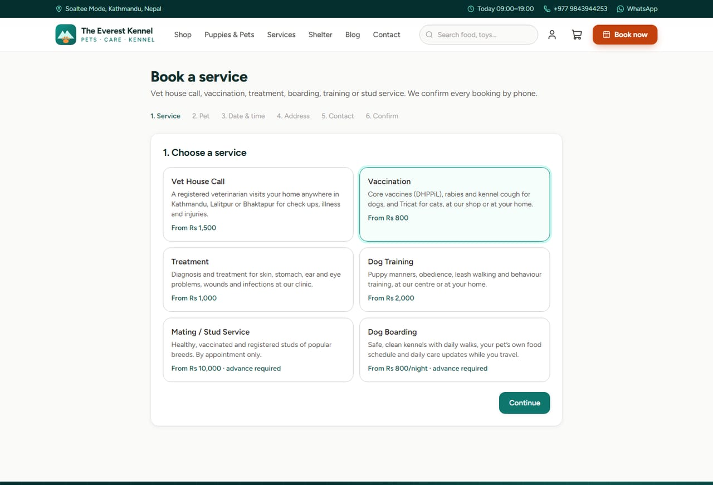
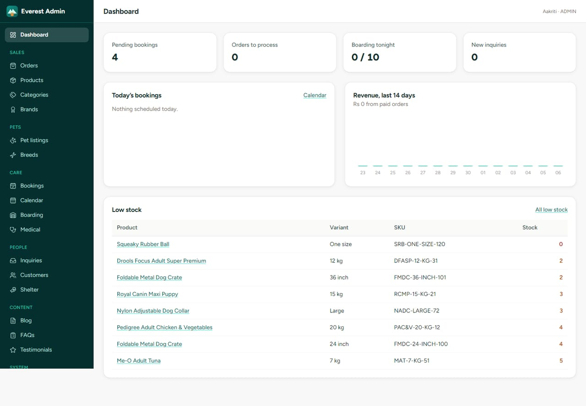
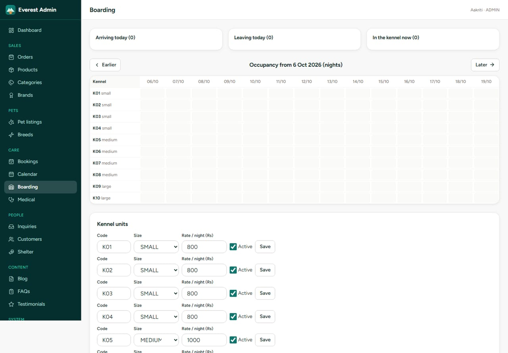
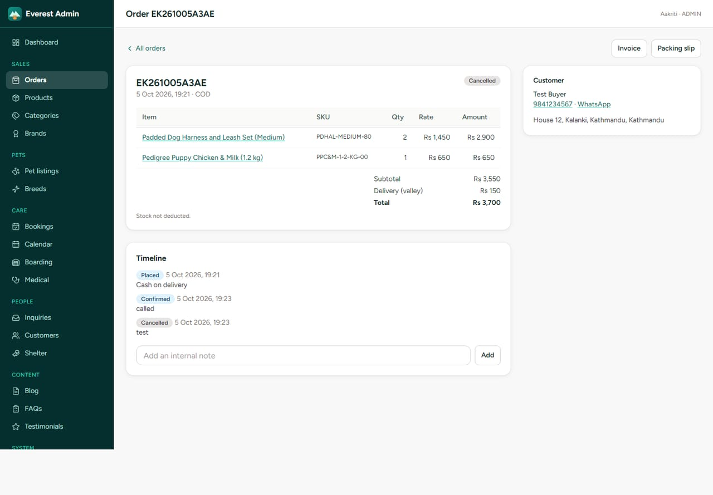

# The Everest Kennel

Website, online shop, booking system and admin panel for **The Everest Kennel**: pet shop, kennel, veterinary home service and animal care shelter at Soaltee Mode, Kathmandu.

Built from `everest-kennel-project.md` (the blueprint) with Node.js, Express 5, TypeScript, Prisma, MySQL/MariaDB, EJS server rendering and Tailwind CSS.

> This is a Node.js app. It lives in `htdocs` but is **not** served by Apache/PHP. XAMPP is only used for its MySQL (MariaDB) server.

## Screenshots

### Home page
Call, WhatsApp and booking buttons up front, the eight services, featured puppies, best sellers, reviews and the shelter.


### On a phone
Built mobile first. A sticky bar keeps **Call · WhatsApp · Book** one tap away on every page.


### Shop: food, accessories and toys
Filter by category, pet, life stage, brand and price, and search by name, brand or SKU. Pay by cash on delivery, eSewa or Khalti.

| Shop | Product |
|---|---|
|  |  |

### Puppies and pets for sale
Every listing shows age, vaccination, deworming, microchip and KCI papers. Buyers can ask on WhatsApp with the listing code, schedule a visit, or reserve with a deposit.

| Pets for sale | Pet details |
|---|---|
|  |  |

### Booking and checkout
Book a vet house call, vaccination, treatment, boarding, training or stud service with live free slots. Guests verify their phone by SMS. Checkout works as a guest or with an account.

| Book a service | Checkout |
|---|---|
|  |  |

### Customer account and animal shelter
Customers keep their pets' vaccination history and get SMS reminders before each dose. The shelter lists animals for adoption and takes reports of injured animals.

| My account | Shelter |
|---|---|
|  |  |

### Admin panel (for the shop team)
One place for orders, stock, bookings, boarding, medical records, the shelter and reports.

| Dashboard | Booking calendar |
|---|---|
|  |  |

| Boarding occupancy | Order management |
|---|---|
|  |  |

Products, pets and posts in the screenshots are demo data.

## Quick start (Windows + XAMPP)

1. Start **MySQL** in the XAMPP control panel.
2. Create the database and user (once):
   ```sql
   CREATE DATABASE everest_kennel CHARACTER SET utf8mb4 COLLATE utf8mb4_unicode_ci;
   CREATE USER 'ek_user'@'localhost' IDENTIFIED BY 'ek_local_pass';
   GRANT ALL PRIVILEGES ON everest_kennel.* TO 'ek_user'@'localhost';
   GRANT ALL PRIVILEGES ON `everest_kennel_%`.* TO 'ek_user'@'localhost';           -- test database
   GRANT ALL PRIVILEGES ON `prisma_migrate_shadow_db_%`.* TO 'ek_user'@'localhost'; -- prisma migrate dev
   GRANT CREATE, DROP ON *.* TO 'ek_user'@'localhost';
   ```
3. Install and run:
   ```bash
   cp .env.example .env        # set NODE_ENV=development, DB values, SMS_PROVIDER=log, empty SMTP_HOST
   npm ci
   npx prisma migrate deploy
   npm run db:seed             # prints the admin password once
   npm run css:build
   npm run dev                 # http://localhost:3000
   npm run dev:worker          # optional: cron jobs (reminders, expiry, sitemap)
   ```

In development, SMS (including OTP codes) and emails are **printed to the console** instead of being sent.

### Local credentials (this machine)

The local `.env` is already configured, and the database is migrated and seeded with demo content.

| | |
|---|---|
| Admin | `admin@everestkennel.local` (or phone `9843944253`), password `EverestAdmin#2026` |
| Demo vet | phone `9800000001` (random password; reset it in Admin > Users if needed) |

Change the admin password before using real data. A fresh `npm run db:seed` on an empty database generates a random password, or uses `ADMIN_PASSWORD` if set.

## What is included

**Public site**: home, shop (category/brand/species/life stage/price filters, FULLTEXT search on name/description plus brand and SKU, variants, stock badges, "notify me", related and recently viewed), pets for sale (filters, health records, video, WhatsApp with listing code, visit request, reserve with eSewa/Khalti deposit), sell your pet (photo upload), services pages with FAQ schema, a 6-step booking wizard, shelter (adopt, application with home check questions, report an animal with photo and GPS), blog, about, contact (honeypot plus time check plus rate limit), FAQ, four policy pages, sitemap.xml and robots.txt. There is a sticky mobile Call / WhatsApp / Book bar and a click-to-load map.

**Customer account**: register/login by phone or email (Argon2id), my pets with weight log and vaccination/medical history, orders with status timeline and printable invoice, bookings with reschedule/cancel up to 12 hours before, saved addresses, profile and password, and account deletion.

**Checkout and payments**: cash on delivery, eSewa ePay v2 (HMAC signature and status API check), Khalti KPG-2 (initiate and lookup). Amounts are verified against the database, and callbacks are idempotent. Delivery fees cover inside Ring Road, the rest of the valley, and outside the valley by weight.

**Booking rules**: slots come from opening hours minus blocked dates minus booked places, with a lead time per service. House call capacity equals the number of active vets. Boarding auto-assigns a free kennel. House calls are limited to the Kathmandu Valley. Required advances (mating, 1 night for boarding) must be paid within 30 minutes, and guests verify their phone by SMS OTP.

**Admin (`/admin`)**: dashboard (today's bookings, pending orders, low stock, boarding occupancy, 14-day revenue chart), products (variants, WebP photos, stock adjustments with reasons, CSV import/export), categories, brands, breeds, pet listings (gallery, sell to customer), orders (status workflow with SMS, packing slip, invoice, COD reconciliation), bookings (list, week calendar, assign vet, phone/walk-in bookings), boarding (14-night occupancy grid, check in/out, daily care log with photo, kennel units), medical (vaccinations with reminders, treatment records), shelter (animals, adoption applications), inquiries, customers (history and notes), blog/FAQs/testimonials, reports (sales, top products, service revenue, CSV), settings (business info, hours, closed dates, service prices and capacity, delivery fees, payment toggles, SEO, home page), users and roles, and an audit log of every admin write.

Roles: `STAFF` (operations), `VET` (assigned bookings and medical records only), `ADMIN` (everything, including settings, users and the audit log). Role changes take effect on the next request.

**Worker** (`npm run worker`, or `node dist/worker-once.js` from cron on shared hosting):
- Vaccination reminders 7 days and 1 day before the due date (08:00 NPT).
- Releases pet reservations after 72 hours and hides sold pets after 30 days.
- Cancels unpaid online orders and bookings after 30 minutes.
- Regenerates the hourly sitemap.

## Design system

These were picked with the UI/UX Pro Max design database:

- **Style:** "Soft UI Evolution": white surfaces, soft layered shadows (`shadow-soft`, `shadow-lift`), 12–16px radius, 200ms transitions, `prefers-reduced-motion` respected.
- **Colors** (`tailwind.config.js`): teal `brand-*` (primary `brand-700` #0f766e, 5.4:1 on white) and orange `accent-*` for calls to action (`accent-700` #c2410c with white text, 5.2:1).
- **Type:** Figtree, self-hosted as one variable WOFF2 file (`public/assets/fonts`, 20 KB).
- **Icons:** [Lucide](https://lucide.dev) outline icons (ISC), rendered server side as inline SVG with `<%- icon('name', 'size-5') %>`. Icons are decorative by default; pass a third `label` argument for meaningful ones. To add an icon, download `https://cdn.jsdelivr.net/npm/lucide-static@1.52.0/icons/<name>.svg` into `src/icons/` and run `node scripts/build-icon-module.mjs`. WhatsApp uses its brand mark. No emoji are used as icons.
- **Logo and social images:** `public/assets/img/logo.svg`. Regenerate the PNG icons and Open Graph images with `npm run icons`.

## Scripts

| Command | |
|---|---|
| `npm run dev` | Dev server with reload plus Tailwind watch |
| `npm run build` / `npm start` | Production build to `dist/` and run it |
| `npm run worker` | Cron worker (production build) |
| `npm test` | Unit plus integration tests (resets `everest_kennel_test`) |
| `npm run test:unit` | Unit tests only, no database |
| `npm run test:e2e` | Playwright (needs `npx playwright install` and a running dev server) |
| `npm run lint` / `npm run typecheck` | ESLint / TypeScript |
| `npm run db:migrate` / `npm run db:seed` | Apply migrations / seed |

## Project structure

```
prisma/            schema.prisma, migrations, seed.ts
src/app.ts         Express app (helmet CSP, sessions in MySQL, CSRF, rate limits)
src/config/        env validation (zod), business constants
src/lib/           prisma, logger, money (paisa), dates (Nepal time), sms, mailer, notify, audit, csv, tx retry
src/middleware/    auth/roles, csrf, uploads (multer + sharp WebP), validation, anti-spam, errors, view locals
src/modules/       one folder per domain: schema, service, controller (+ admin/*)
src/routes/        web.ts, api.ts (/api/v1), admin.ts
src/jobs/          worker jobs
src/views/         EJS layouts, partials and pages
public/assets/     built CSS, app.js, booking.js, images
tests/             unit, integration (supertest), e2e (playwright)
```

## Deployment

See sections 17 and 18 of the blueprint. `Dockerfile`, `docker-compose.yml`, `ecosystem.config.cjs` (PM2) and `.github/workflows/ci.yml` are included. In production set `NODE_ENV=production`, real SMTP, `SMS_PROVIDER=sparrow` or `aakash`, live eSewa/Khalti keys, and `APP_URL` with https.

## Differences from the blueprint

These are deliberate, and all of them are documented in the code:

- **Table names are snake_case** (`@@map`), so migrations behave the same on Windows MySQL (`lower_case_table_names=1`) and Linux.
- **Vanilla JS instead of Alpine.js.** The strict CSP (`script-src 'self'`) forbids inline expressions, so two small modules (`app.js`, `booking.js`, about 20 KB) do the enhancement. Every form works without JavaScript.
- **Invoices are print-ready HTML** (browser "Save as PDF") rather than generated PDF files.
- **Catalog pages use `Cache-Control: private`** instead of `public`, because each page carries a per-visitor CSRF token.
- **Additions the features needed:** `OrderEvent` (status timeline), `PetWeight`, `Service.leadMinutes`, `Payment.userId`, `Order.stockDeducted/codCollected/deliveryZone`, `Booking.advancePaisa/staffNotes`, `PetListing.healthCertificate`, `User.adminNotes`.
- **Concurrency:** bookings lock the service row inside a SERIALIZABLE transaction and retry on deadlock. Payments lock the payment, order and listing rows. Tests cover 20 parallel requests for one slot, parallel checkouts for the last items, and two deposits for one puppy.
- **Multer is 2.x** (1.x has known vulnerabilities).

## Still needed from the client (blueprint section 21)

Full mobile/WhatsApp number (`WHATSAPP_NUMBER` and Admin > Settings), logo, real photos, prices, vet name and NVC number, exact map pin, live eSewa/Khalti merchant keys, an SMS provider token, social links and real testimonials. Demo products, pets and posts can be removed by resetting the database and seeding with `SEED_DEMO=0`.
